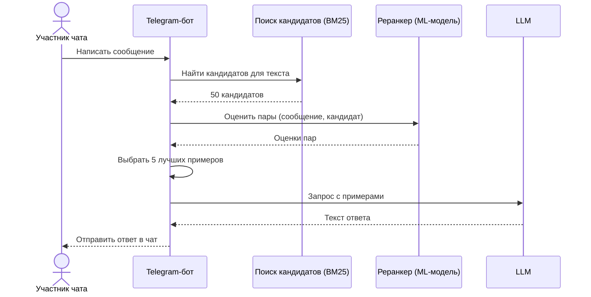
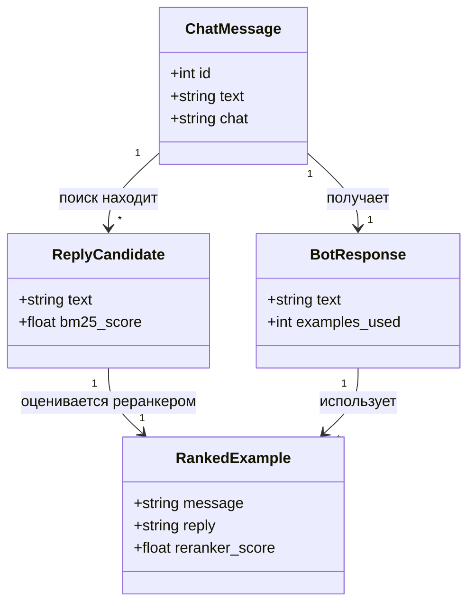

# Диаграммы

## Диаграмма последовательности

Сценарий UC-01 «Ответ на сообщение в чате».

```mermaid
sequenceDiagram
    actor User as Участник чата
    participant Bot as Telegram-бот
    participant Search as Поиск кандидатов (BM25)
    participant Reranker as Реранкер (ML-модель)
    participant LLM as LLM

    User->>Bot: Написать сообщение
    Bot->>Search: Найти кандидатов для текста
    Search-->>Bot: 50 кандидатов
    Bot->>Reranker: Оценить пары (сообщение, кандидат)
    Reranker-->>Bot: Оценки пар
    Bot->>Bot: Выбрать 5 лучших примеров
    Bot->>LLM: Запрос с примерами
    LLM-->>Bot: Текст ответа
    Bot-->>User: Отправить ответ в чат
```

## Диаграмма классов

```mermaid
classDiagram
    class ChatMessage {
        +int id
        +string text
        +string chat
    }
    class ReplyCandidate {
        +string text
        +float bm25_score
    }
    class RankedExample {
        +string message
        +string reply
        +float reranker_score
    }
    class BotResponse {
        +string text
        +int examples_used
    }

    ChatMessage "1" --> "*" ReplyCandidate : поиск находит
    ReplyCandidate "1" --> "1" RankedExample : оценивается реранкером
    ChatMessage "1" --> "1" BotResponse : получает
    BotResponse "1" --> "*" RankedExample : использует
```
